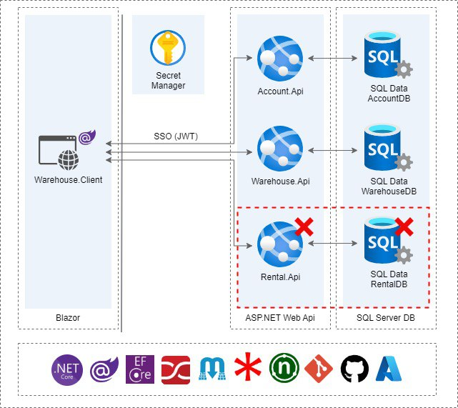
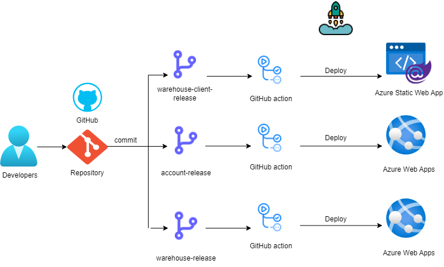

# IT-RUN
This repository contains the following projects:

1. Account Service (SSO)
2. Warehouse Service
3. Rental Service
4. Warehouse Blazor Client App

## Description

### Account Service (SSO)

The Account Service is responsible for Single Sign-On (SSO) functionality. It utilizes JWT (JSON Web Tokens) for authentication and provides SSO capabilities to both the Warehouse Service and the Rental Service.

### Warehouse Service

The Warehouse Service offers various features for warehouse management, including:

- Warehouse management
- Product management
- Product unit of measure (UOM) management
- Product category management
- Sale and purchase product functionalities

### Rental Service

The Rental Service encompasses a range of functionalities for rental management, including:

- Employee management
- Renter management
- Dashboard
- Payment processing
- Transaction tracking

### Services structure

### CI/CD

## Usage

Please refer to the individual project directories for detailed instructions on how to set up and use each component of this repository.

